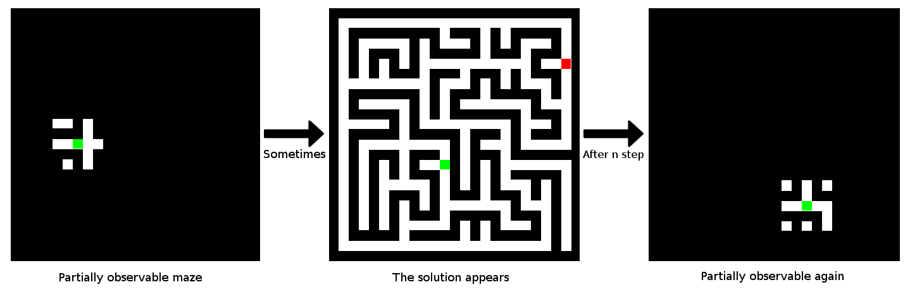

# Memory Pathfinding
Partially observable pathfinding sometime totally visible

  

Here the Memory Maze, an partially observable environment that is open sometimes.

The goal of this environment is to mimick RTS games :
It's partially observable, and when you see the ennemy strategy, you know what to do. Pathfinding is for "really long task"
(But there is more, the hierarchical continous action problems for example)

To solve this environment in a generic way, we need a **memory** and **planning**.

